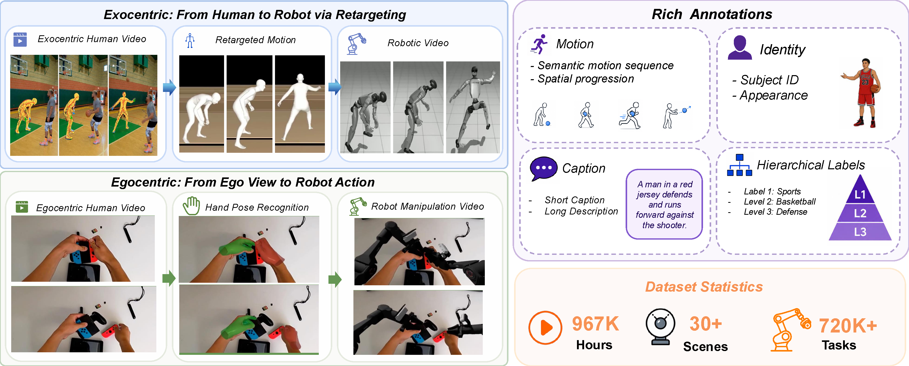

<div align="center">

## HumanNet: Human-Centric Video Learning and Embodied AI Resources

**DAGroup & SimpleSilicon Innovation Team**

Peking University

</div>

## 🔥 News
* `[2026.05.22]` 🔥 We reprocessed a compliant embodied dataset on our university cluster. In this version, we removed non-compliant third-person source data and, after the full data pipeline, obtained a high-quality first-person robot video dataset with **3M videos**, **720P resolution**, and **30 FPS**. To the best of our knowledge, **RoVid-X** is the largest robot video generation dataset to date for training physics-aware models. See [Dataset](https://huggingface.co/datasets/DAGroup-PKU/RoVid-X)  | [resources](./src/dataset/rovid-x/).
* `[2026.05.18]` 🔥 We release **StableVLA**. Congratulations on its acceptance to **ICML 2026**! It is a vision-language-action model for robust robot policy learning. See [Docs](./docs/stablevla.md) | [Code](./src/model/StableVLA/) | [Project](https://dagroup-pku.github.io/StableVLA/) | [Paper](https://arxiv.org/abs/2605.18287) | [Checkpoint](https://huggingface.co/DAGroup-PKU/StableVLA/tree/main).
* `[Next Month]` 🔥 We are preparing the open-source release of the HumanNet corpus, the curation pipeline, and the post-training validation code. Stay tuned!
* `[2026.05.11]`🔥 The **HumanNet** technical report and project page have been released: [Paper](https://arxiv.org/abs/2605.06747) | [Project](https://dagroup-pku.github.io/HumanNet/).

## 📑 Todo List
- [x] Release the **HumanNet** technical report on arXiv. ✅
- [x] Release **StableVLA** model code and documentation. ✅
- [x] Release **RoVid-X** on Hugging Face. ✅
- [ ] Release a HumanNet preview subset on Hugging Face for early access.
- [ ] Release the full one-million-hour HumanNet corpus with metadata and annotations.
- [ ] Release the trained checkpoints initialized from HumanNet.


## 📣 Overview

This repository is maintained as a growing research hub for human-centric video data, embodied learning models, and validation code. It currently centers on **HumanNet**, a one-million-hour human-centric video corpus, and will also host related models, training recipes, evaluation protocols, and release notes.

The initial core release is **HumanNet**, a scalable infrastructure for fine-grained activity understanding, motion-aware video learning, and embodied pretraining. HumanNet pairs first-person and third-person footage with caption labels, motion annotations, and hand and body signals, organized by a multi-axis taxonomy and produced by a curation pipeline that treats human-centric filtering, viewpoint characterization, quality control, and privacy review as first-class design choices.


## 🎥 Demo
https://github.com/user-attachments/assets/52eaa410-0ec4-4f89-81e8-d2ecf9bb351c


## 📚 Dataset Family

| Dataset | Status | Documentation | Resources |
|---|---|---|---|
| **HumanNet** | Documentation available | [Docs](./docs/humandata.md) | [src/dataset/humandata](./src/dataset/humandata/) |
| **RoVid-X** | Released on Hugging Face | [Dataset card](https://huggingface.co/datasets/DAGroup-PKU/RoVid-X) | [Hugging Face](https://huggingface.co/datasets/DAGroup-PKU/RoVid-X) / [src/dataset/rovid-x](./src/dataset/rovid-x/) |

## 🤖 Model Family

| Model | Status | Documentation | Code |
|---|---|---|---|
| **StableVLA** | Code and docs available | [Docs](./docs/stablevla.md) | [src/model/StableVLA](./src/model/StableVLA/) |

## 🗂️ Repository Map

```text
HumanNet/
├── README.md                 # Repository entry point
├── docs/                     # Component-level documentation and release notes
│   ├── humandata.md          # HumanNet dataset documentation
│   └── stablevla.md          # StableVLA documentation
├── assets/                   # Figures used by the repository README
└── src/
    ├── dataset/
    │   ├── humandata/        # HumanNet dataset resources
    │   └── rovid-x/          # ROViD-X dataset resources
    └── model/
        └── StableVLA/        # StableVLA source code, training scripts, and model README
```


## 🔧 Usage
*Coming soon.*

```bash
# Download a HumanNet subset (placeholder)
# if you are in china mainland, run this first: export HF_ENDPOINT=https://hf-mirror.com
# pip install -U "huggingface_hub[cli]"
huggingface-cli download DAGroup-PKU/HumanNet

# Download RoVid-X
huggingface-cli download DAGroup-PKU/RoVid-X --repo-type dataset
```


## 🙏 Acknowledgement
We gratefully acknowledge **SimpleSilicon Innovation** for providing funding and resource support, and **Astribot** for providing real-robot platforms and deployment experiment support.

## 📧 Ethics Concerns
The videos referenced in this repository are sourced from public domains and intended solely to showcase the capabilities of this research. Human-centric video raises non-trivial privacy, consent, and dual-use concerns; any release will follow license review, redaction, restricted-content filtering, access controls where necessary, and clear documentation of what is included or excluded.

* The service is a research preview. Please contact us if you find any potential violations.

## ✏️ Citation

If you find our work useful in your research, please consider giving a star :star: and citation :pencil:.

### BibTeX
```bibtex
@article{deng2026humannet,
  title={HumanNet: Scaling Human-centric Video Learning to One Million Hours},
  author={Deng, Yufan and Zhou, Daquan},
  journal={arXiv preprint arXiv:2605.06747},
  year={2026}
}

@misc{fu2026stablevlarobustvisionlanguageactionmodels,
      title={StableVLA: Towards Robust Vision-Language-Action Models without Extra Data}, 
      author={Yiyang Fu and Chubin Zhang and Shukai Gong and Yufan Deng and Kaiwei Sun and Qiyang Min and Qibin Hou and Yansong Tang and Jianan Wang and Daquan Zhou},
      year={2026},
      eprint={2605.18287},
      archivePrefix={arXiv},
      primaryClass={cs.CV},
      url={https://arxiv.org/abs/2605.18287}, 
}

```
